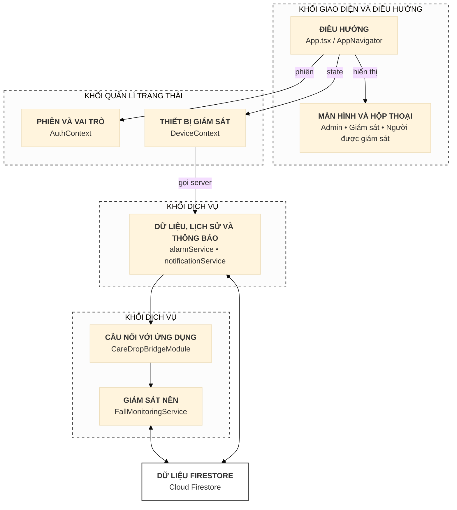
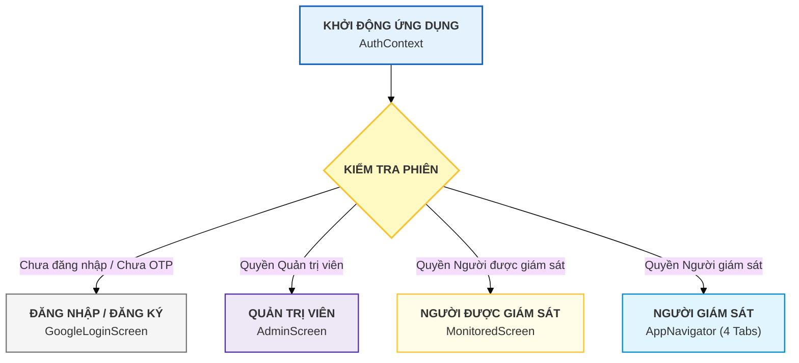
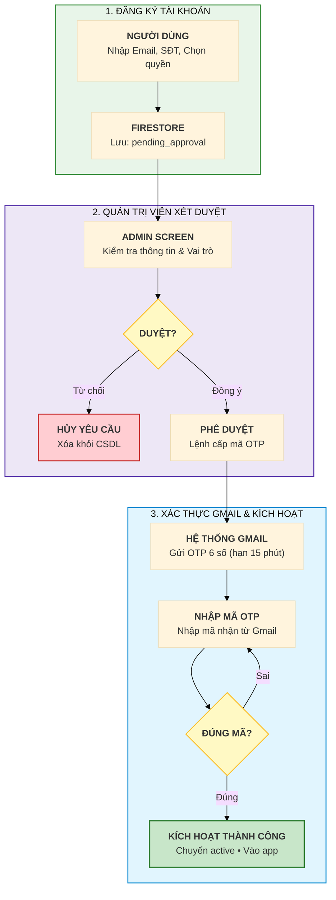
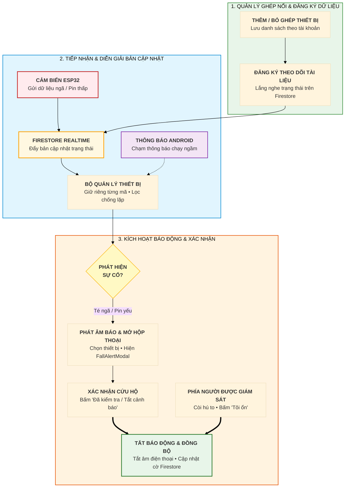
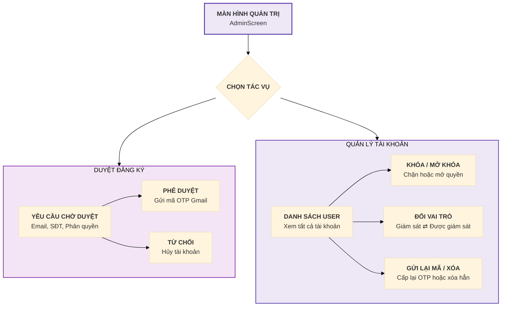
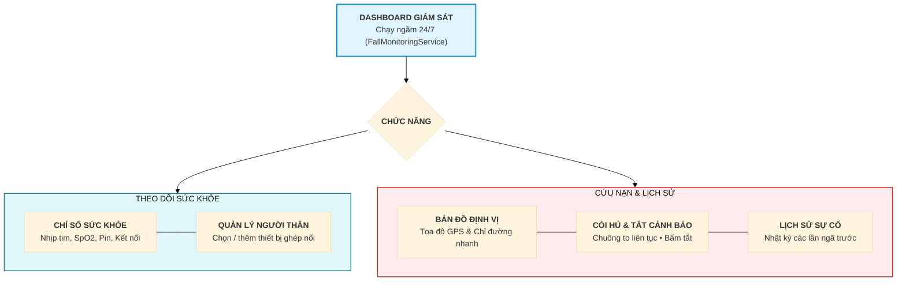
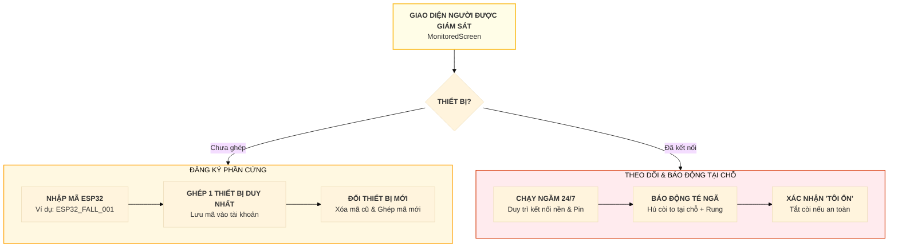

# CareDrop - Hệ Thống Cảnh Báo Té Ngã & Giám Sát Sức Khỏe Thông Minh

Tài liệu lưu đồ hoạt động hệ thống CareDrop được thiết kế theo tỷ lệ **chuẩn hóa cho báo cáo Word / Đồ án**:
* Kích thước mỗi sơ đồ **thu gọn vừa vặn trong 1 trang Word** (khoảng 1/2 đến 2/3 trang A4).
* Phông chữ to, nét đậm, chữ ít và cô đọng giúp **chụp màn hình dán vào Word không bị mờ hay chữ bé xíu**.
* Đầy đủ 100% chức năng của **3 phân quyền** (*Quản trị viên, Người giám sát, Người được giám sát*) và sự tương tác giữa các bên.
* Toàn bộ sơ đồ sử dụng văn bản thuần túy, không chèn biểu tượng/icon để đảm bảo tính trang trọng trong văn bản báo cáo.

---

## 1. Kiến Trúc Khối & Điều Hướng Hệ Thống (Architecture & Navigation)

Lưu đồ kiến trúc phân khối chức năng và cơ chế tương tác giữa Giao diện, Quản lý trạng thái, Dịch vụ nền và Cơ sở dữ liệu:

### 1.1. Chi Tiết Phân Luồng 3 Vai Trò Người Dùng

---

## 2. Tương Tác 3 Phân Quyền: Quy Trình Đăng Ký & Phê Duyệt

Luồng tương tác xác thực email bảo mật giữa Người dùng, Quản trị viên và Dịch vụ Email:

---

## 3. Quản Lý Thiết Bị, Tiếp Nhận Cảnh Báo Té Ngã & Xử Lý Khẩn Cấp

Lưu đồ xử lý chính khi ứng dụng hoạt động (Hình 3.10 - Quản lý thiết bị, vòng đời đăng ký và cập nhật cảnh báo):

---

## 4. Lưu Đồ Hoạt Động Chi Tiết Của Từng Phân Quyền

### 4.1. Nghiệp Vụ Quản Trị Viên (Admin)

---

### 4.2. Nghiệp Vụ Người Giám Sát (Supervisor)

---

### 4.3. Nghiệp Vụ Người Được Giám Sát (Monitored Person)

---

## 5. Bảng Tóm Tắt Phân Quyền & Tính Năng

| Tính năng chính | Quản trị viên (Admin) | Người giám sát (Supervisor) | Người được giám sát (Monitored) |
| :--- | :---: | :---: | :---: |
| **Phê duyệt & Kích hoạt qua Gmail** | Toàn quyền | Không | Không |
| **Khóa / Mở khóa / Đổi phân quyền** | Toàn quyền | Không | Không |
| **Đăng ký phần cứng ESP32** | Không | Không | Có (Duy nhất 1 thiết bị, có thể đổi) |
| **Theo dõi nhiều người thân** | Có | Có | Không |
| **Chuông báo thức liên tục khi ngã** | Không | Có (Còi hú + Rung) | Có (Còi hú + Rung tại chỗ) |
| **Định vị bản đồ & Dẫn đường GPS** | Không | Có | Không |
| **Tắt cảnh báo sự cố** | Không | Có (Đã kiểm tra) | Có (Nút 'Tôi ổn') |
| **Chạy ngầm 24/7 (Foreground Service)** | Không | Có | Có |
